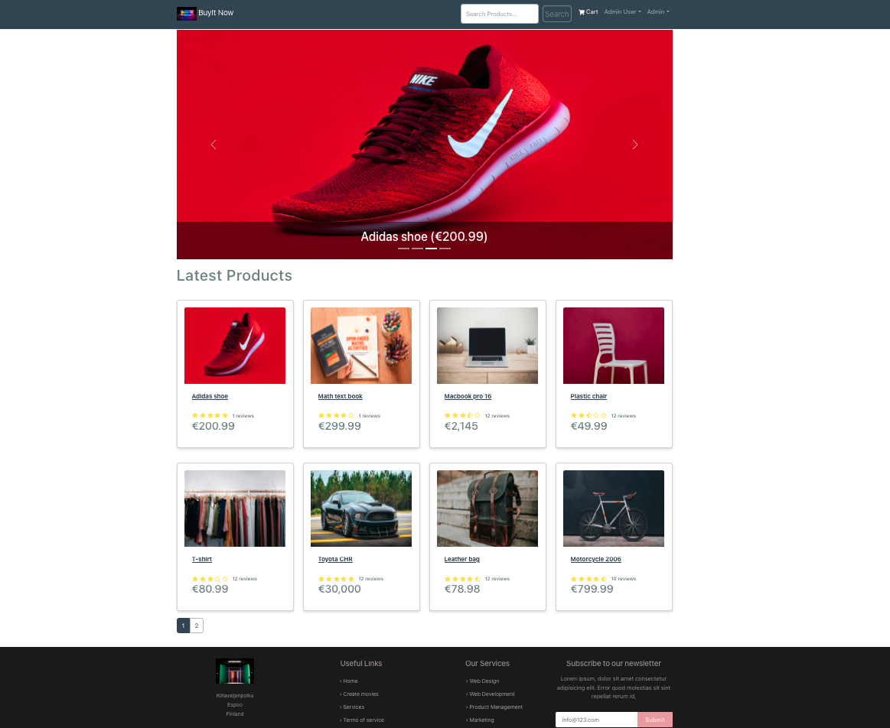
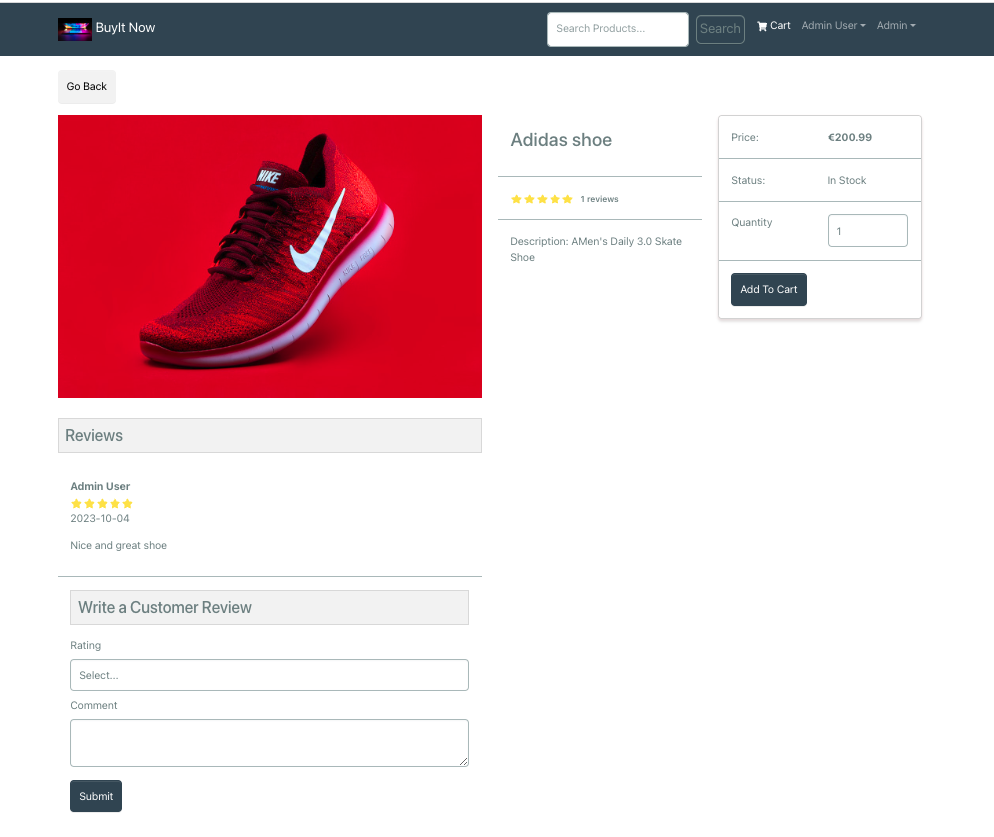
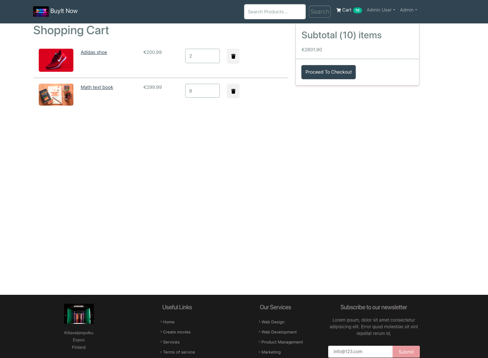
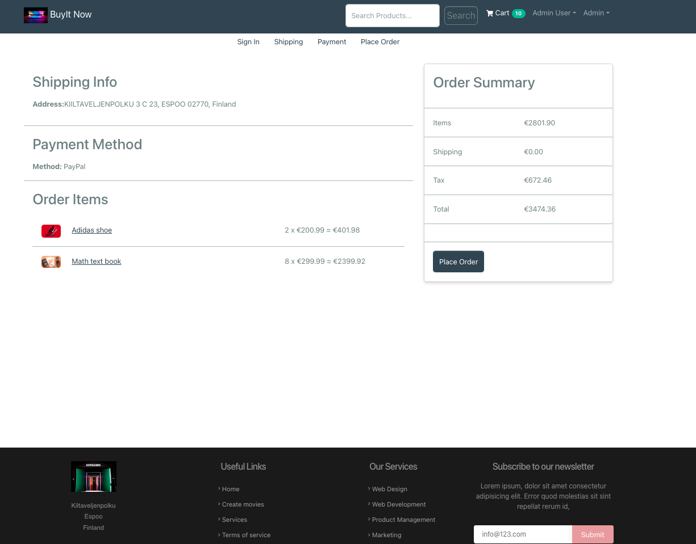
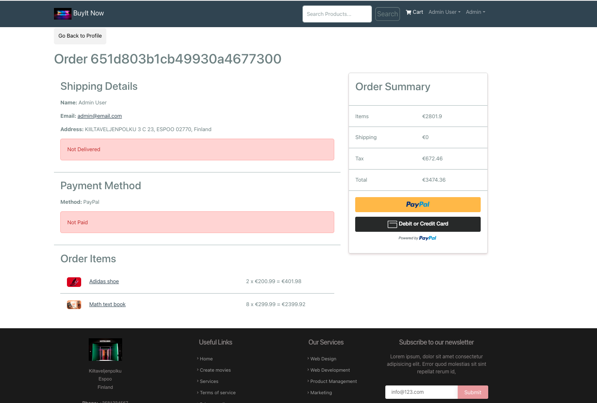

# BuyIt Project

## Table of content

- [Introduction](#introduction)
- [Technologies](#technologies)
- [Installation](#installation)
- [Getting started](#getting-started)

## Technologies
- Backend
    + MongoDB
    + NodeJS
    + ExpressJS
    + Mongoose
    + dotenv
    + bcryptjs
    + jsonwebtoken
- Frontend
    + RectJS
    + React-bootstrap(for design and styling)
    + Redux
    + react-router-dom
    + Redux toolkit
    + jwt-decode
    + React Stripe

## Getting started
### Frontend (UI) page

### Product details

### Cart page

### Order Summary page

### Payment  page

